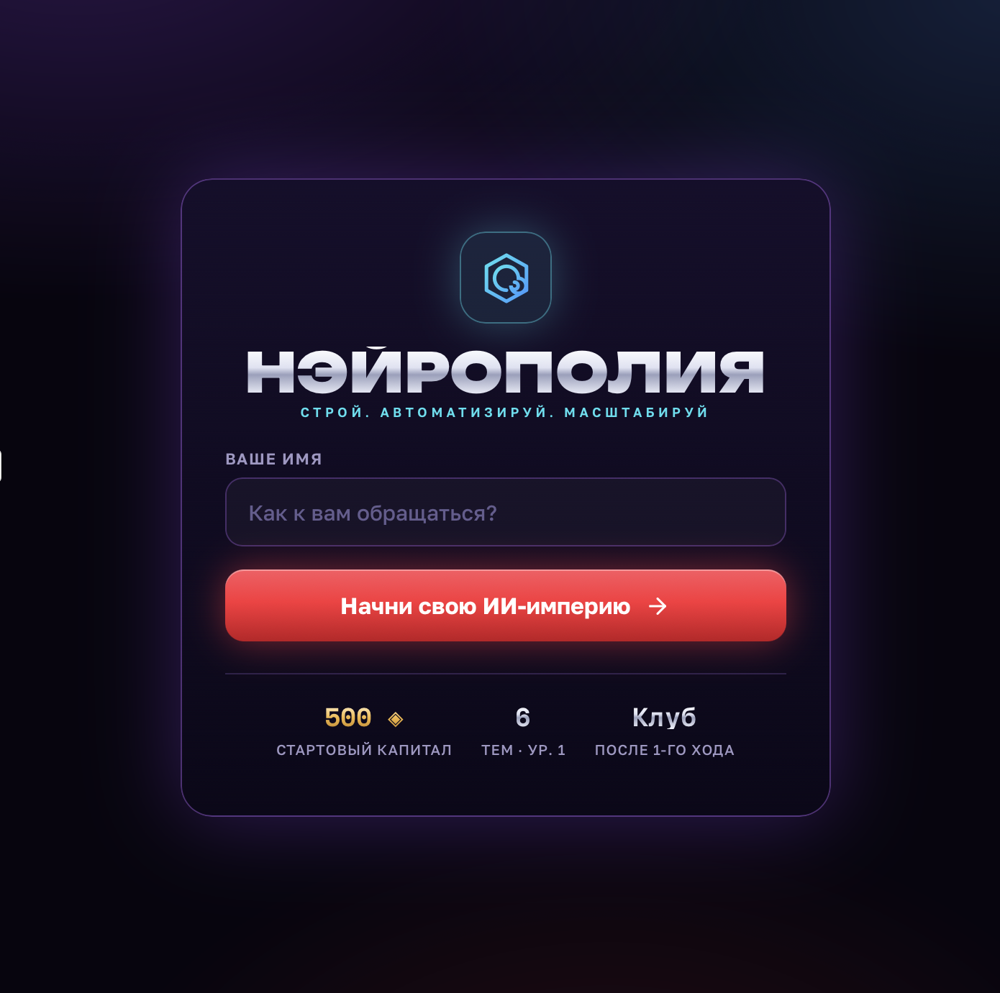

Российские курорты накрыл «идеальный шторм»: продажи пакетных туров по стране упали. Эксперты связывают это со снижением покупательной способности, ростом цен на размещение и конкуренцией зарубежных направлений — туристы всё чаще выбирают более доступные курорты соседних стран.

Что это значит для отельера? Раньше можно было надеяться, что туроператор приведёт гостей. Сегодня этот канал проседает, и ставка на прямые бронирования становится не вопросом роста, а вопросом выживания. Когда туристов мало, каждое обращение — на вес золота. Но многие отели продолжают терять звонки и сообщения, даже не замечая этого.

Почему это происходит? Администратор не виноват: он физически не может ответить одновременно на звонок, сообщение в Telegram и вопрос гостя на стойке. Но у туриста нет контекста. Он не знает, что вы заняты, — он просто перезванивает в отель, который ответил быстрее. Пока вы спите или разбираете заезд, гость уходит к конкуренту.

Я вижу, как отельеры пытаются бороться снижением тарифов. Но дешёвый номер не спасает, если гость не смог до вас дозвониться. Цена работает только тогда, когда о вас узнали. А узнают о вас те, кто ответил первым.

Выход — не ждать возвращения турпотока, а выжимать максимум из каждого обращения уже сейчас. Есть инструменты, которые позволяют это сделать без расширения штата.

Посмотрите, как это работает, на интерактивной демонстрации: https://neuru.ru/ai-porter?utm_source=dzen&utm_medium=publication&utm_campaign=pub-week36&utm_content=07.09-12:00-news

Хэштеги: #отели #гостиничныйбизнес #туризм #автоматизация #нейру

Промпт для картинки: Два телефонных аппарата на стойке администратора: один лежит без внимания со снятой трубкой, второй активно используется. Контраст между пустым и заполненным, передающий идею «каждое обращение ценно, когда гостей мало». Фото без текста.

Знаков: 1200

---

Иллюстрация: 